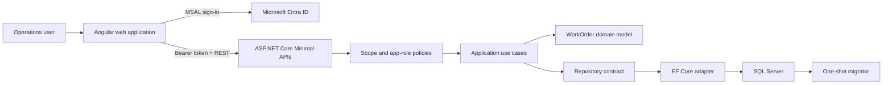
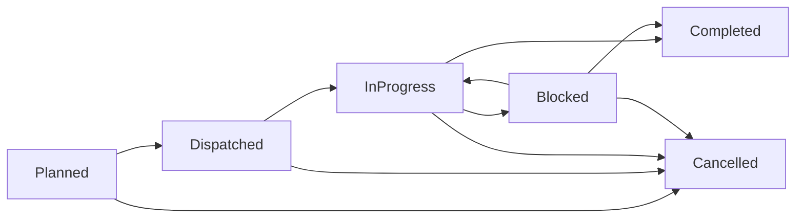
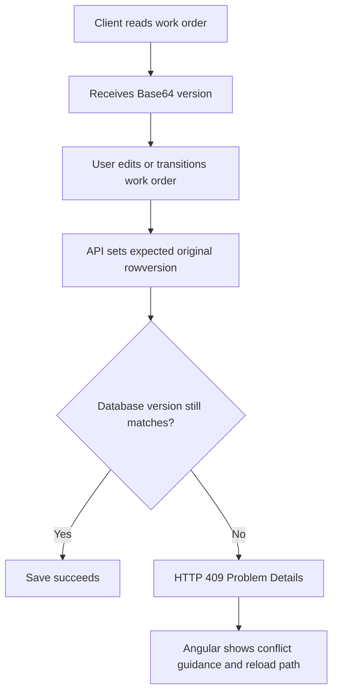
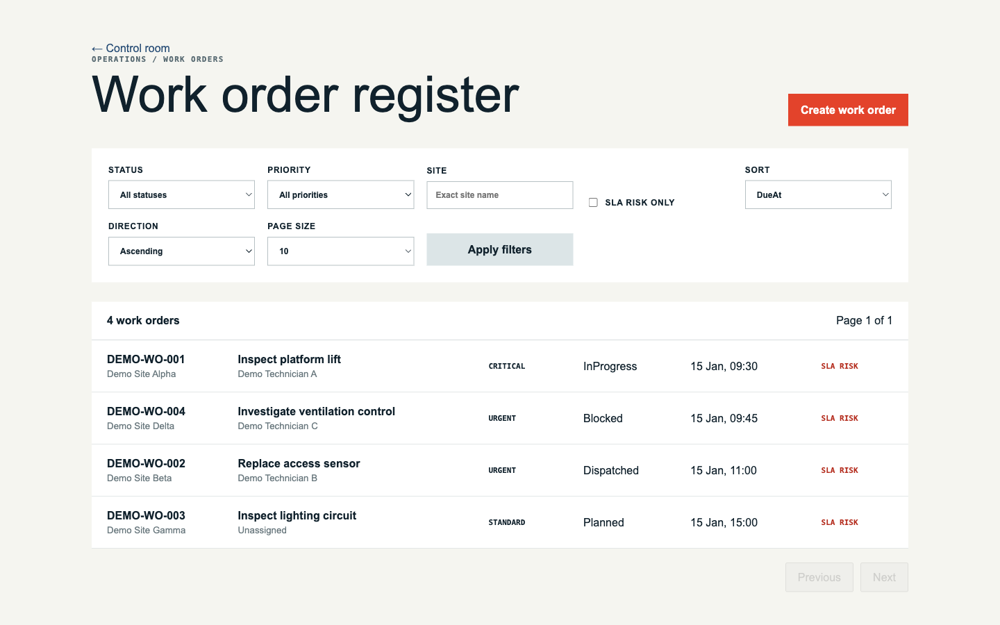
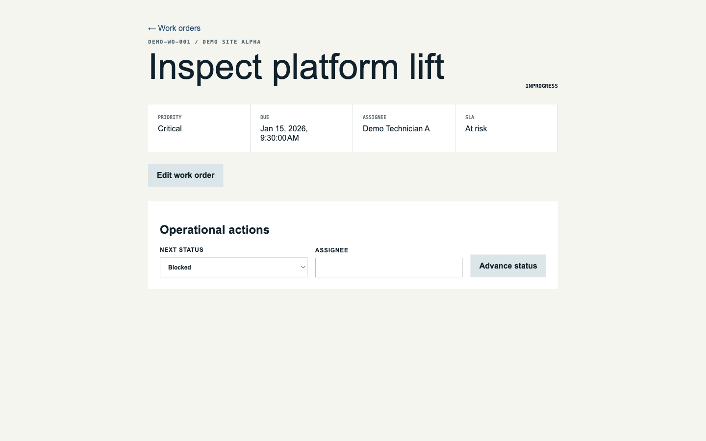
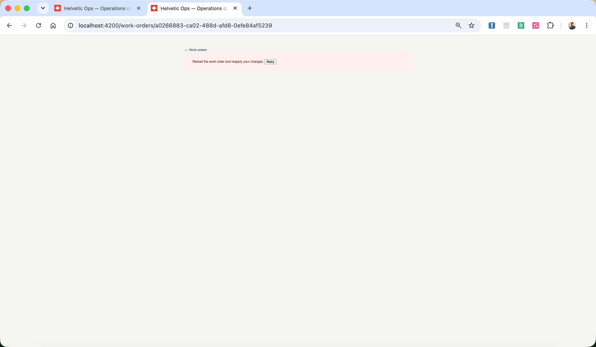

# Helvetic Operations Platform

Work-order management for multi-site operations, built with ASP.NET Core, EF Core, SQL Server, Angular, and Microsoft Entra ID.

[](https://github.com/JinyanShao/helvetic-operations-platform/actions/workflows/ci.yml)
[](LICENSE)
[](https://dotnet.microsoft.com/)
[](https://angular.dev/)

## Overview

Helvetic Operations Platform models the day-to-day workflow behind operational work orders: planning work, assigning operators, progressing legal status transitions, tracking SLA risk, and preserving an audit trail for changes that matter.

The repository contains a single backend application, a SQL Server persistence layer, and an Angular frontend that share one work-order model and one authenticated API surface. Updates are guarded by optimistic concurrency so stale writes do not silently overwrite newer data, and write operations are constrained by explicit role-based policies.

Microsoft Entra ID is the only implemented authentication path for protected workflows. The frontend uses MSAL for sign-in and token acquisition, while the API enforces delegated scope and app-role requirements on every protected endpoint.

## Engineering Highlights

- Work-order lifecycle rules are enforced in the domain model instead of being accepted as arbitrary status writes.
- SQL Server `rowversion` values are used as optimistic concurrency tokens and exposed through the API as Base64 versions.
- Stale updates return HTTP 409 Problem Details responses and are surfaced in the Angular client as a reload-and-retry flow.
- Authorization is enforced server-side with delegated `access_as_user` scope checks and hierarchical `Operations.*` app-role policies.
- The Angular client consumes an NSwag-generated TypeScript contract, and CI validates that the generated client stays in sync with the checked OpenAPI document.
- Database migrations run through a dedicated one-shot migrator container; the API does not migrate the database at startup.
- GitHub Actions provides continuous integration across backend build/test, migration validation, Angular validation, generated-client drift checks, and production container builds.

## Architecture



The backend is a layered modular monolith: domain rules stay inside `HelveticOps.Domain`, use-case orchestration lives in `HelveticOps.Application`, SQL Server persistence is implemented in `HelveticOps.Infrastructure`, and transport, validation, and authorization are handled by `HelveticOps.Api`.

On the frontend, Angular routes and components call the generated API client rather than maintaining handwritten duplicate DTOs. The generated client is rebuilt from `web/openapi.json` through NSwag and checked in CI with `npm run api:check`.

## Work Order Lifecycle

The lifecycle is enforced by `WorkOrder` in [`src/HelveticOps.Domain/WorkOrders/WorkOrder.cs`](src/HelveticOps.Domain/WorkOrders/WorkOrder.cs).



Current rules enforced by code and tests:

- New work orders start as `Planned`.
- Only `Planned` work orders can be dispatched, and dispatch requires an assignee.
- Only `Dispatched` work orders can start.
- Only `InProgress` work orders can become `Blocked`.
- Only `Blocked` work orders can resume to `InProgress`.
- Only `InProgress` or `Blocked` work orders can be completed.
- `Cancelled` and `Completed` are terminal states.
- Cancellation requires a reason and is only allowed while the work order is still open.

Lifecycle changes are not accepted as direct field updates. The API calls application services, which in turn invoke guarded domain methods such as `DispatchTo`, `Start`, `Block`, `Resume`, `Complete`, and `Cancel`.

## Concurrency and Conflict Handling

Work-order writes use SQL Server `rowversion` as the concurrency boundary.



In practice:

- `Version` is mapped as an EF Core rowversion in [`src/HelveticOps.Infrastructure/Persistence/Configurations/WorkOrderConfiguration.cs`](src/HelveticOps.Infrastructure/Persistence/Configurations/WorkOrderConfiguration.cs).
- The application service decodes the incoming Base64 version and sets it as the original value before saving.
- A stale write triggers `DbUpdateConcurrencyException`, which the repository translates into `WorkOrderConcurrencyException`.
- The API returns HTTP 409 for that condition.
- The Angular detail workflow treats HTTP 409 as a conflict state and exposes reload guidance instead of pretending the write succeeded.
- Rejected stale writes do not persist audit events; repository tests verify the transaction is rolled back consistently.

The same version check is applied to update, transition, and cancellation operations.

## Authentication and Authorization

Authenticated workflows depend on Microsoft Entra ID.

- Angular uses `MsalGuard` for protected routes and `MsalInterceptor` for API calls.
- The API validates bearer tokens with Microsoft Identity Web.
- Every protected policy requires both:
  - delegated scope `access_as_user` in `scp`
  - one of the accepted app roles in `roles`

Current server-side policy hierarchy:

| Role | API permissions |
|---|---|
| `Operations.Viewer` | Read dashboard and work orders |
| `Operations.Dispatcher` | Viewer permissions plus create, update, assign, and transition |
| `Operations.Manager` | Dispatcher permissions plus cancellation |

Server-side authorization is authoritative. Angular hides unavailable actions for usability, but button visibility is not a security boundary.

Full registration and configuration steps are in [docs/entra/README.md](docs/entra/README.md).

## Frontend and API Contracts

The Angular application in [`web/`](web/) uses:

- generated API access through [`web/src/app/api/generated/`](web/src/app/api/generated/)
- a facade layer for list/detail/create/update/transition/cancel operations
- route-level authenticated workflows for dashboard, work-order list, create, detail, and redirect handling
- explicit loading, empty, saving, retry, and conflict states

The backend exposes Minimal API endpoints for:

- list and detail reads
- work-order creation
- editable field updates
- guarded status transitions
- manager-only cancellation

The checked OpenAPI document is [`web/openapi.json`](web/openapi.json), and the NSwag configuration is [`web/nswag.json`](web/nswag.json).

## Getting Started

The shortest local path from the repository root is:

```bash
cp .env.example .env
docker compose up --build --wait
curl --fail http://localhost:5080/health
curl --fail --head http://localhost:4200/
```

Before starting the stack, set these values in `.env`:

- `SQL_PASSWORD`
- `ENTRA_TENANT_ID`
- `ENTRA_SPA_CLIENT_ID`
- `ENTRA_API_CLIENT_ID`
- `ENTRA_API_BASE_URL`

Local endpoints:

- Web UI: `http://localhost:4200`
- API health: `http://localhost:5080/health`
- Swagger UI (development): `http://localhost:5080/swagger`

Compose startup order is:

1. SQL Server becomes healthy
2. Migrator completes successfully
3. API becomes healthy
4. Web container becomes healthy

`SEED_DATA=true` in `.env.example` enables deterministic development seed data for local use. Authenticated workflows still require valid Entra configuration and role assignment.

For native Angular development, create `web/public/config/entra-config.json` from the checked example file and keep the generated file uncommitted. Full setup details are in [docs/entra/README.md](docs/entra/README.md).

No development authentication bypass is provided.

## Testing

Run the main validation commands from the repository root:

```bash
dotnet test HelveticOps.sln --configuration Release
npm ci --prefix web
npm test --prefix web
npm run build --prefix web
npm run api:check --prefix web
npm run e2e --prefix web
```

The test and validation layers cover different risks:

- **Domain tests** verify lifecycle and invariant behavior.
- **Service and API tests** verify create, update, transition, cancellation, validation, not-found handling, and authorization.
- **Repository and SQL Server integration tests** verify filtering, sorting, pagination, migrations, rowversion conflicts, and audit rollback on stale writes.
- **Angular tests** verify facade usage, list/detail rendering, form behavior, and client state handling.
- **Contract validation** checks that the generated TypeScript client matches the checked OpenAPI document.
- **Playwright flows** cover authenticated list, filtering/pagination, detail, create, edit, transition, cancellation, and conflict recovery.

Authenticated Playwright requires Microsoft Entra session-storage files for Dispatcher and Manager users. The Work Order business tests provision their own records and cancel them during cleanup; they do not require fixed Work Order IDs or references.

Generate local sessions with a running app and real Entra login:

```bash
npm run e2e:auth:dispatcher --prefix web
npm run e2e:auth:manager --prefix web
```

Then run the business flows:

```bash
E2E_BASE_URL=http://localhost:4200 \
E2E_DISPATCHER_SESSION_STORAGE=web/.auth/dispatcher-storage.json \
E2E_MANAGER_SESSION_STORAGE=web/.auth/manager-storage.json \
npm run e2e --prefix web -- e2e/work-orders.spec.ts
```

When protected Entra configuration is unavailable in GitHub Actions, the authenticated workflow is intentionally skipped rather than reported as executed coverage. Configure repository secrets `E2E_BASE_URL`, `E2E_DISPATCHER_SESSION_STORAGE_JSON`, and `E2E_MANAGER_SESSION_STORAGE_JSON` to run it.

## Application Preview

The repository includes current authenticated UI screenshots under [`docs/images/`](docs/images/).

**Work order list**



List view with status, priority, site, and SLA-risk filtering plus server-side pagination.

**Work order detail**



Detail view with audit history and role-gated operational actions.

**Conflict handling**



Conflict state after a stale write is rejected with HTTP 409.

## Limitations

- The repository contains an Azure Bicep baseline, not a completed Azure deployment.
- Production secrets management, Key Vault integration, private networking, and production observability are not implemented.
- The authenticated Playwright suite is wired for protected Entra-backed execution, but its execution still depends on external tenant configuration and session artifacts.
- Microsoft Entra ID configuration is required for protected workflows; the repository does not include a local identity substitute.

Current implementation and verification boundaries are tracked in [docs/IMPLEMENTATION.md](docs/IMPLEMENTATION.md).

## Documentation

- [Architecture](docs/architecture/architecture.md) — runtime boundaries, delivery flow, and Azure boundary
- [System evolution](docs/architecture/evolution.md) — implementation sequence and key architectural decisions
- [Microsoft Entra ID setup](docs/entra/README.md) — app registrations, roles, scope, and local configuration
- [Implementation status](docs/IMPLEMENTATION.md) — implemented scope, verified commands, and remaining boundary notes
- [Security policy](SECURITY.md) — vulnerability reporting expectations
- [Contributing](CONTRIBUTING.md) — contribution workflow expectations

## License

MIT © 2026 Jinyan Shao
