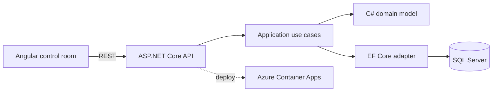

# Helvetic Operations Platform

> A multi-site operations control tower built with ASP.NET Core, EF Core, Angular and SQL Server.

[](https://github.com/JinyanShao/helvetic-operations-platform/actions/workflows/ci.yml)
[](LICENSE)
[](https://dotnet.microsoft.com/)
[](https://angular.dev/)

Helvetic Ops is an enterprise application for coordinating work orders across distributed sites. It turns deadlines, technician capacity and blocked work into a single decision surface for operations leads.

## Why this project

The repository demonstrates an end-to-end enterprise engineering baseline rather than a disconnected set of tutorials: domain modelling in C#, a layered ASP.NET Core API, EF Core persistence, a strict TypeScript Angular client, SQL Server, automated tests, containers, CI and Azure infrastructure as code.

## Product snapshot

The current dashboard includes live operational metrics, SLA risk filtering, responsive navigation and a work queue designed around dispatch decisions.


<details>
<summary>Mobile view</summary>


</details>

## Architecture



The backend follows a pragmatic clean architecture: the domain has no infrastructure dependencies, application use cases own ports, and EF Core implements persistence at the edge. See [the architecture notes](docs/architecture/architecture.md) for decisions and trade-offs.

## Run locally

Prerequisites: Docker Desktop and Docker Compose.

```bash
cp .env.example .env
# Replace SQL_PASSWORD in .env with a strong local value.
docker compose up --build
```

- Web: `http://localhost:4200`
- API: `http://localhost:5080`
- OpenAPI in development: `http://localhost:5080/swagger`
- Health: `http://localhost:5080/health`

For native development, install .NET 8 and Node.js 22, then run `dotnet run --project src/HelveticOps.Api` and `npm start --prefix web`.

## Test and build

```bash
dotnet test
npm ci --prefix web
npm run build --prefix web
```

## Status

The foundation is implemented: domain lifecycle rules, persistence adapter, API endpoints, responsive Angular dashboard, domain tests, Docker composition, CI and an Azure infrastructure baseline. Authentication, migrations, end-to-end tests and production networking remain roadmap work.

The explicit [implementation status](docs/IMPLEMENTATION.md) separates shipped behavior from planned work.

## Repository map

```text
src/          Domain, application, infrastructure and API projects
tests/        Automated .NET tests
web/          Angular client
infra/bicep/  Azure infrastructure as code
docs/         Architecture and implementation evidence
.github/      CI and repository governance
```

## License

MIT © 2026 Jinyan Shao
