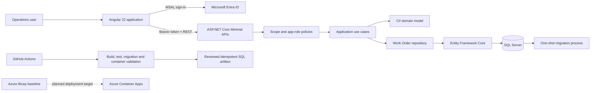

# Helvetic Operations Platform

[](https://github.com/JinyanShao/helvetic-operations-platform/actions/workflows/ci.yml)
[](LICENSE)
[](https://dotnet.microsoft.com/)
[](https://angular.dev/)

## Project Overview

Helvetic Operations Platform is an operations control tower for managing work orders across distributed sites. It demonstrates a complete delivery path with .NET 8, ASP.NET Core Minimal APIs, Entity Framework Core, SQL Server, Angular 22, TypeScript, Microsoft Entra ID, Docker Compose and GitHub Actions.

## Business Problem

Operations teams need one reliable view of planned, dispatched, active, blocked, completed and cancelled work. The platform supports the decisions behind that workflow: finding SLA risk, assigning technicians, progressing legal states, resolving concurrent edits and preserving an audit history.

## Current Capabilities

Implemented and verified:

- Domain-controlled lifecycle: `Planned` → `Dispatched` → `InProgress` / `Blocked` → `Completed`, with `Cancelled` as a terminal Manager action
- SQL Server persistence through Entity Framework Core migrations and explicit mappings
- SQL Server `rowversion` optimistic concurrency with Base64 API versions and HTTP 409 conflict handling
- Work Order list, detail, create, update, transition and cancellation use cases
- Server-side pagination; status, priority, site and SLA-risk filters; explicit safe sorting
- Audit events for successful status transitions and cancellation, without fabricated actor identities
- ASP.NET Core Minimal APIs with OpenAPI, Problem Details and explicit FluentValidation execution
- Angular list, detail, create and edit flows, operational actions, loading/empty/error/saving states and conflict recovery
- NSwag-generated TypeScript API contracts with deterministic drift checking
- Microsoft Entra ID token, delegated-scope and app-role authorization boundaries
- One-shot database migrator, health-ordered Docker Compose startup and production image builds
- GitHub Actions validation for backend, database migrations, Angular, generated contracts and containers

## Architecture



The backend is a pragmatic modular monolith. Domain rules do not depend on ASP.NET Core or Entity Framework Core; application use cases coordinate operations; infrastructure implements persistence; the API handles transport, validation and authorization.

Azure Bicep records the intended deployment direction only. Production Azure deployment, Key Vault, private endpoints and production observability are not implemented. See [Architecture](docs/architecture/architecture.md).

## Technology Stack

| Area | Technology |
|---|---|
| Backend | .NET 8, C#, ASP.NET Core Minimal APIs, Problem Details, OpenAPI |
| Persistence | Entity Framework Core 8, SQL Server, EF Core migrations, `rowversion` |
| Frontend | Angular 22, TypeScript, Reactive Forms, Angular Router and HttpClient |
| Identity | Microsoft Entra ID, MSAL, delegated scope and app roles |
| Contract generation | NSwag from the checked OpenAPI contract |
| Testing | xUnit, Testcontainers for SQL Server, Respawn, Angular unit tests, Playwright |
| Delivery | Docker, Docker Compose, GitHub Actions, Dependabot, Azure Bicep baseline |

## Local Setup

Prerequisites: Docker Desktop with Docker Compose. Copy the local environment template, then add or set `SQL_PASSWORD`, `ENTRA_TENANT_ID`, `ENTRA_SPA_CLIENT_ID`, `ENTRA_API_CLIENT_ID` and `ENTRA_API_BASE_URL` with a strong local SQL password and real Microsoft Entra identifiers. Do not commit `.env`.

```bash
cp .env.example .env
docker compose up --build --wait
curl --fail http://localhost:5080/health
curl --fail --head http://localhost:4200/
```

Endpoints:

- Angular: `http://localhost:4200`
- API health: `http://localhost:5080/health`
- Development OpenAPI UI: `http://localhost:5080/swagger`

The Compose dependency chain is SQL Server healthy → Migrator completed successfully → API healthy → Web healthy. Development seed data is opt-in through `SEED_DATA=true`; it is disabled by default in Compose.

Stop the stack and remove its local database volume with:

```bash
docker compose down --volumes
```

See [Microsoft Entra ID setup](docs/entra/README.md) before the first authenticated run.

## Database Migrations

The checked migration is applied by the dedicated one-shot Migrator container. The production API process does not run migrations or seed data at startup.

Official EF Core commands for a configured development connection are:

```bash
dotnet tool install --global dotnet-ef --version 8.0.8
dotnet ef database update --project src/HelveticOps.Infrastructure --startup-project src/HelveticOps.Api --context OperationsDbContext
dotnet ef migrations has-pending-model-changes --project src/HelveticOps.Infrastructure --startup-project src/HelveticOps.Api --context OperationsDbContext
dotnet ef migrations script --idempotent --project src/HelveticOps.Infrastructure --startup-project src/HelveticOps.Api --context OperationsDbContext --output operations-migrations.sql
```

Supply `ConnectionStrings__OperationsDb` or the design-time `--connection` argument. Production releases should apply a reviewed migration bundle or reviewed idempotent SQL with a separate deployment identity and an approved rollback plan.

## Authentication and Roles

Angular uses MSAL route protection and `MsalInterceptor`; it does not manually persist access tokens. The API validates the Microsoft Entra ID access token, delegated scope `access_as_user` and the required app role.

| Role | Permissions |
|---|---|
| `Operations.Viewer` | Read dashboard and Work Orders |
| `Operations.Dispatcher` | Viewer permissions plus create, edit, assign and transition Work Orders |
| `Operations.Manager` | Dispatcher permissions plus cancel Work Orders and future administrative operations |

Server authorization is authoritative. UI visibility is only a usability aid. Configuration steps are in [Microsoft Entra ID setup](docs/entra/README.md).

## Testing

Run the verified suites from the repository root:

```bash
dotnet test HelveticOps.sln --configuration Release
npm ci --prefix web
npm test --prefix web
npm run build --prefix web
npm run api:check --prefix web
npm run e2e --prefix web
```

Current verified totals:

- Backend: 30 passed, 0 failed, 0 skipped
- Angular: 19 passed, 0 failed, 0 skipped
- Playwright: 8 authenticated flows configured; 8 explicitly skipped because protected Microsoft Entra test configuration is unavailable

The backend suite includes domain, service, repository, API, authorization, migration and concurrency coverage against the real SQL Server engine where persistence matters.

## CI/CD

GitHub Actions runs:

- .NET restore, Release build and all backend tests
- SQL Server integration tests and migration application to a clean database
- pending-model-change validation and idempotent migration SQL generation
- Angular dependency installation, high-severity production dependency audit, unit tests and production build
- NSwag generated-client drift validation
- API and Web production image builds
- authenticated Playwright only when every protected Entra value and deterministic fixture identifier is available

The migration SQL is uploaded as a reviewable artifact. When protected Playwright configuration is absent, the authenticated job is visibly skipped and the configuration job records the reason; it is never reported as an executed pass.

## Current Status

The Work Order delivery milestone is implemented and reproducible. Persistence, migrations, concurrency, audit records, API validation and authorization policies, Angular read/write workflows, generated contracts, Docker delivery and CI validation are complete at repository level.

The system is not presented as production-deployed. Live authenticated browser evidence and the Azure production environment remain outside the completed boundary. See [Implementation status](docs/IMPLEMENTATION.md).

## Roadmap

- Execute all 8 authenticated Playwright flows with protected Microsoft Entra test configuration
- Capture final authenticated list, detail, form, filter/pagination and conflict/action screenshots
- Deploy the reviewed application and migration artifact to Azure Container Apps
- Integrate Key Vault and private endpoints
- Add OpenTelemetry, Application Insights dashboards and production operational alerts
- Complete production runbooks, rollback evidence and operational acceptance

## Screenshots

Authenticated UI screenshots are pending manual Microsoft Entra login and acceptance. No fabricated images, broken links or placeholder screenshots are included in this delivery.

## License

MIT © 2026 Jinyan Shao
