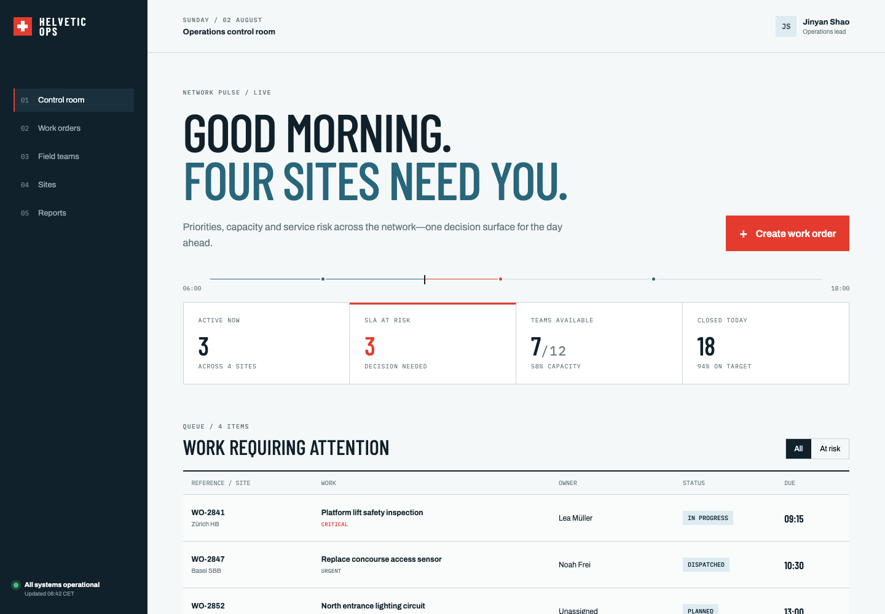
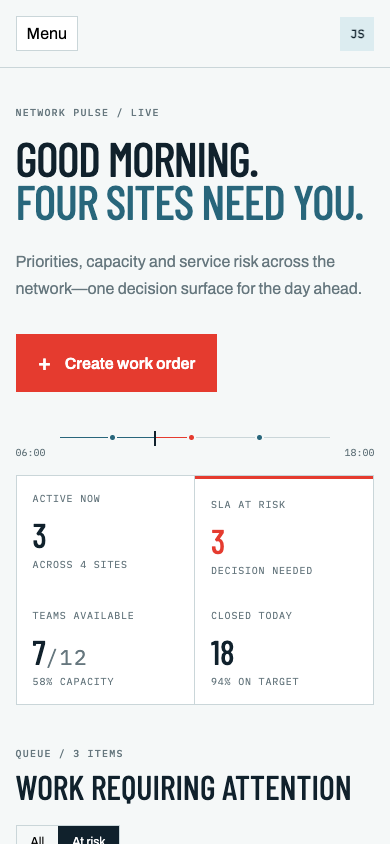
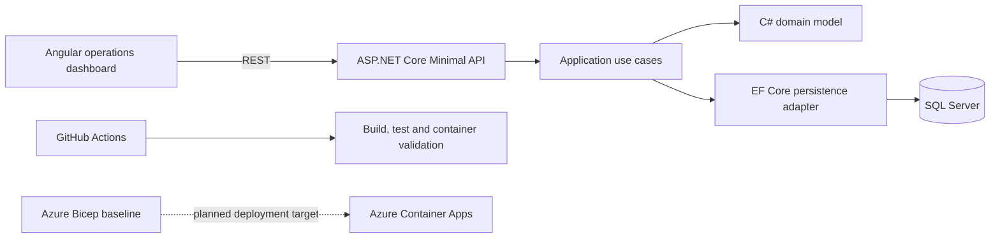

# Helvetic Operations Platform

> A multi-site operations control tower built with ASP.NET Core, EF Core, Angular and SQL Server.

[](https://github.com/JinyanShao/helvetic-operations-platform/actions/workflows/ci.yml)
[](LICENSE)
[](https://dotnet.microsoft.com/)
[](https://angular.dev/)

Helvetic Ops is a portfolio-grade enterprise application for coordinating work orders across distributed sites. It turns deadlines, technician capacity and blocked work into a single decision surface for operations leads.

## Why this project

The repository demonstrates an end-to-end enterprise engineering baseline rather than a disconnected set of tutorials: domain modelling in C#, a layered ASP.NET Core API, EF Core persistence, a strict TypeScript Angular client, SQL Server, automated tests, containers, CI and Azure infrastructure as code.

## Product snapshot

The current Angular dashboard presents operational metrics, SLA-risk filtering, responsive navigation and a dispatch-oriented work queue using the implemented demonstration data flow.

The interface is designed around the decisions an operations lead needs to make: identifying blocked work, prioritising SLA risk and reviewing technician capacity. Server-backed dashboard queries, pagination and production authentication remain documented roadmap work.



<details>
<summary>Mobile view</summary>


</details>

## Architecture



The backend follows a pragmatic clean architecture: the domain has no infrastructure dependencies, application use cases define the required boundaries, and EF Core implements persistence at the edge.

The Azure Bicep code currently establishes an infrastructure baseline. A deployed Container Apps environment, Key Vault integration, private networking and production observability remain roadmap work.

See [the architecture notes](docs/architecture/architecture.md) for decisions and trade-offs.

## Technical highlights

### Guarded domain lifecycle

Work-order state changes are enforced through domain methods rather than direct property mutation. Invalid transitions are rejected close to the business rule they violate.

### Pragmatic clean architecture

The domain model remains independent from ASP.NET Core and EF Core. Application use cases coordinate workflows, while infrastructure adapters implement persistence and delivery concerns.

### Explicit HTTP failure contracts

The API uses ASP.NET Core Problem Details to return consistent, machine-readable failures instead of leaking framework exceptions or ad hoc response shapes.

### Typed Angular delivery

The Angular client uses strict TypeScript, typed operational models and responsive layouts. Current interaction includes SLA-risk filtering and dispatch-oriented dashboard navigation.

### Repeatable engineering workflow

GitHub Actions validates the .NET build, domain tests, Angular production build and both container images. Dependabot is configured to keep dependencies visible and reviewable.

### Azure-ready infrastructure baseline

Bicep templates document the intended Azure deployment direction without presenting the production environment as already deployed.

## Run locally

Prerequisites: Docker Desktop and Docker Compose.

```bash
cp .env.example .env
# Replace SQL_PASSWORD in .env with a strong local value.
docker compose up --build
```

- Web: `http://localhost:4200`
- API: `http://localhost:5080`
- OpenAPI in development: `http://localhost:5080/swagger`
- Health: `http://localhost:5080/health`

For native development, install .NET 8 and Node.js 22, then run `dotnet run --project src/HelveticOps.Api` and `npm start --prefix web`.

## Test and build

```bash
dotnet test
npm ci --prefix web
npm run build --prefix web
```

## Status

The current foundation is implemented and reproducible locally:

- Guarded work-order domain lifecycle and SLA-risk calculation
- Application-service and repository boundaries
- EF Core SQL Server persistence mapping
- ASP.NET Core Minimal API with OpenAPI, CORS, Problem Details and health checks
- Responsive Angular dashboard with strict TypeScript and interactive risk filtering
- Domain unit tests
- Multi-stage API and web containers
- GitHub Actions build, test and container validation
- Azure Bicep infrastructure baseline

The following capabilities remain roadmap work and are not presented as complete:

- Microsoft Entra ID authentication and role-based authorisation
- EF Core migrations and production seed strategy
- Optimistic concurrency and audit logging
- Server-backed dashboard queries and pagination
- Angular component tests and Playwright end-to-end tests
- Deployed Azure Container Apps modules, Key Vault and private endpoints
- OpenTelemetry, Application Insights and operational alerts

The explicit [implementation status](docs/IMPLEMENTATION.md) separates shipped behavior from planned work.

## Repository map

```text
src/          Domain, application, infrastructure and API projects
tests/        Automated .NET tests
web/          Angular client
infra/bicep/  Azure infrastructure as code
docs/         Architecture and implementation evidence
.github/      CI and repository governance
```

## License

MIT © 2026 Jinyan Shao
