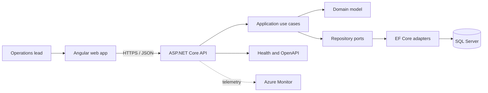

# Architecture

Helvetic Ops uses a modular monolith for a deliberately small operational domain. It keeps transactional boundaries simple while preserving seams for future extraction.

## Decisions

- **Modular monolith first:** one deployable API is appropriate for the current domain and team size.
- **Domain-owned transitions:** status changes live on `WorkOrder`, preventing invalid workflows regardless of entry point.
- **Ports at the application boundary:** use cases depend on repository interfaces, not EF Core.
- **Standalone Angular components:** less framework ceremony and a direct path to lazy feature routes.
- **Configuration outside source:** production connection strings are supplied through environment variables or Azure secrets.

## Deployment target

The Bicep baseline provisions Azure Container Apps infrastructure, Azure SQL, Container Registry and Log Analytics. Identity, networking, Key Vault and application deployment are the next infrastructure milestone.
