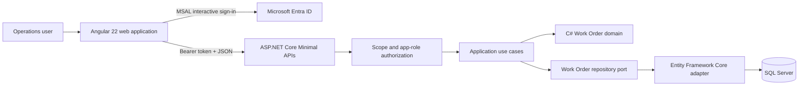
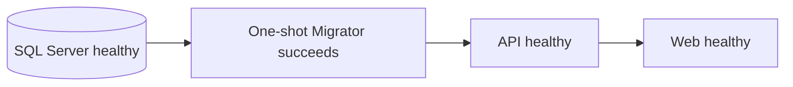
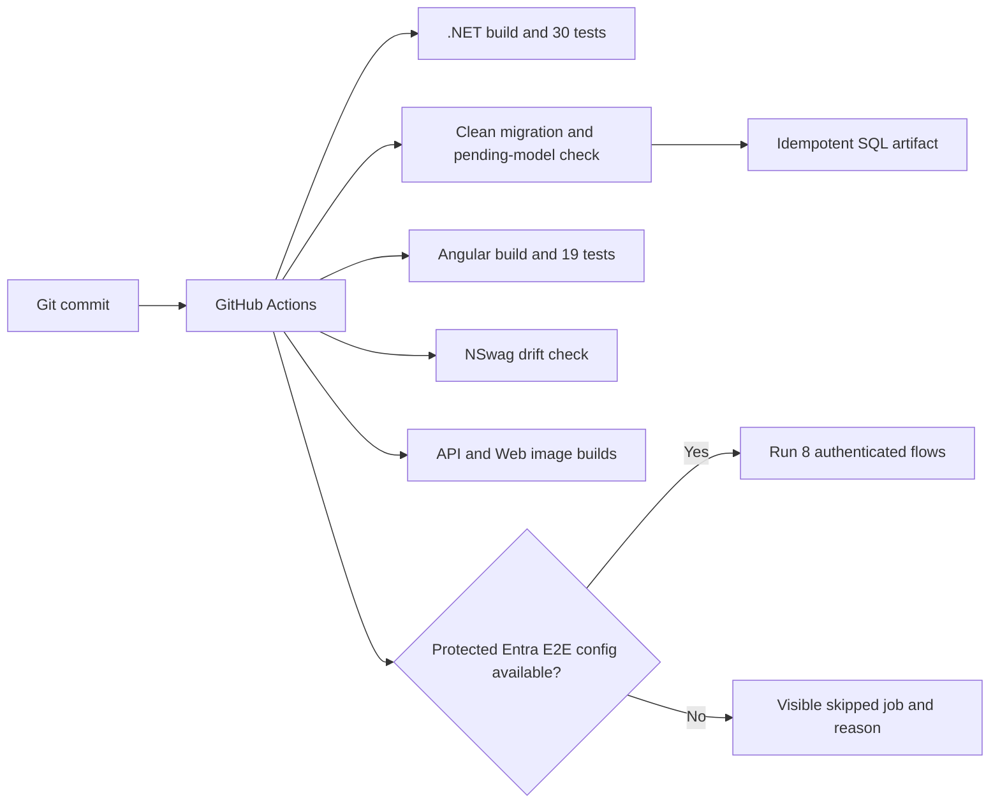

# Architecture

Helvetic Operations Platform is a modular monolith for a focused operational domain. It keeps Work Order transactions and deployment boundaries simple while separating domain rules, application orchestration, persistence and delivery concerns.

## Runtime architecture

## Local delivery sequence

The API process does not run migrations or production seed data. Docker Compose defaults seeding to disabled. The Migrator is the single local migration owner and the API starts only after it exits successfully.

## Delivery architecture

## Key decisions

- **Domain-owned lifecycle:** callers cannot directly set status; legal transitions remain inside `WorkOrder`.
- **Pragmatic application boundary:** Work Order-specific repository contracts support use cases without a generic repository framework.
- **Database concurrency:** SQL Server `rowversion` prevents silent overwrites and is transported as Base64 outside persistence.
- **Explicit failures:** validation, not-found and conflict outcomes use consistent Problem Details contracts.
- **Typed client generation:** NSwag generates Angular contracts from OpenAPI, and drift validation prevents manual divergence.
- **Identity at the boundary:** Microsoft Entra ID supplies access tokens; API policies require `access_as_user` plus the appropriate app role.
- **Reviewed migration delivery:** production should use a reviewed migration bundle or idempotent SQL artifact under a separate deployment identity.

## Azure boundary

The repository contains an Azure Bicep infrastructure baseline for an intended Azure Container Apps direction. It does not represent a completed deployment environment. Container Apps deployment, Key Vault integration, private endpoints, and production observability remain outside the implemented boundary.
